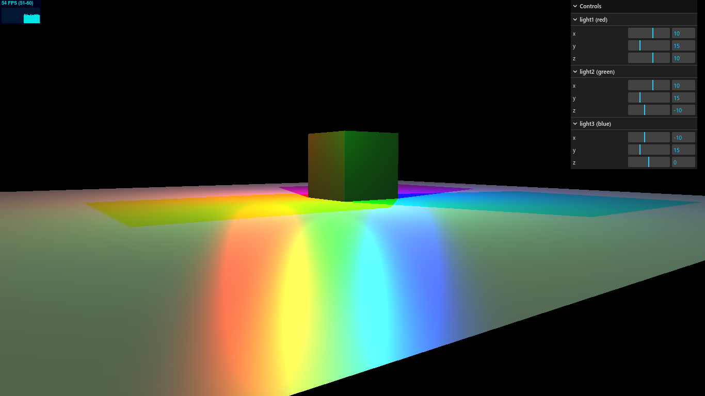

# Taller2-HCG
Estudiante: Jaime Acosta \
Grupo: 1IL131

## Modo de uso:
Por defecto el archivo `index.html` no incluye ninguno de los archivos
necesarios para mostrar tanto la parte 1 como la parte 2, esto solo
en el _main branch_. 

Con el comando `npm start` se levanta el servidor para acceder a
la página web, pero con los comandos `git checkout parte1` y
`git checkout parte2` para iterar sobre ambas partes del taller.
Nótese que es necesario refescar la página para que los cambios tomen
efecto luego de cada git checkout.

## Capturas de Pantalla

### Parte 1

### Parte 2

